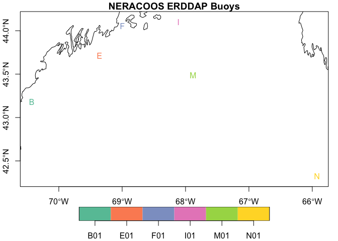

nerddap
================

[NERACOOS](https://www.neracoos.org) makes a wide variety of
[data](https://www.neracoos.org/data/index.html) freely available. Here
we provide simple tools for accessing their [ERDDAP
server](https://www.neracoos.org/erddap/index.html).

## Requirements

[R v4.1+](https://www.r-project.org/)

[rlang](https://CRAN.R-project.org/package=rlang)

[readr](https://CRAN.R-project.org/package=readr)

[dplyr](https://CRAN.R-project.org/package=dplyr)

[sf](https://CRAN.R-project.org/package=sf)

[xml2](https://CRAN.R-project.org/package=xml2)

[httr](https://CRAN.R-project.org/package=httr)

## Installation

Use the [remotes](https://CRAN.R-project.org/package=remotes) package to
install directly from github.

    remotes::install("BigelowLab/nerddap)

### Buoys

NERACOOS serves data for a number of buoys.

``` r
suppressPackageStartupMessages({
  library(nerddap)
  library(sf)
  library(dplyr)
  library(rnaturalearth)
})
```

    ## Warning: package 'sf' was built under R version 4.3.2

``` r
lut = buoy_lut(form = "sf") |> 
  print()
```

    ## Simple feature collection with 6 features and 3 fields
    ## Geometry type: POINT
    ## Dimension:     XY
    ## Bounding box:  xmin: -70.4277 ymin: 42.3233 xmax: -65.9267 ymax: 44.10163
    ## Geodetic CRS:  WGS 84
    ## # A tibble: 6 × 4
    ##   name  longname            id                geometry
    ## * <chr> <chr>               <chr>          <POINT [°]>
    ## 1 wms   Western Maine Shelf B01    (-70.4277 43.18065)
    ## 2 cms   Central Maine Shelf E01     (-69.3578 43.7148)
    ## 3 pb    Penobscot Bay       F01   (-68.99689 44.05495)
    ## 4 ems   Eastern Maine Shelf I01   (-68.11359 44.10163)
    ## 5 jb    Jordan Basin        M01   (-67.88029 43.49041)
    ## 6 nec   Northeast Channel   N01     (-65.9267 42.3233)

``` r
coast = rnaturalearth::ne_coastline("large", returnclass = "sf")
ex = 2
plot(lut['id'], pch = lut$id, axes = TRUE, 
     reset = FALSE, expandBB = rep(ex, 4),
     main = "NERACOOS ERDDAP Buoys")
plot(sf::st_geometry(coast), add = TRUE)
```

<!-- -->
